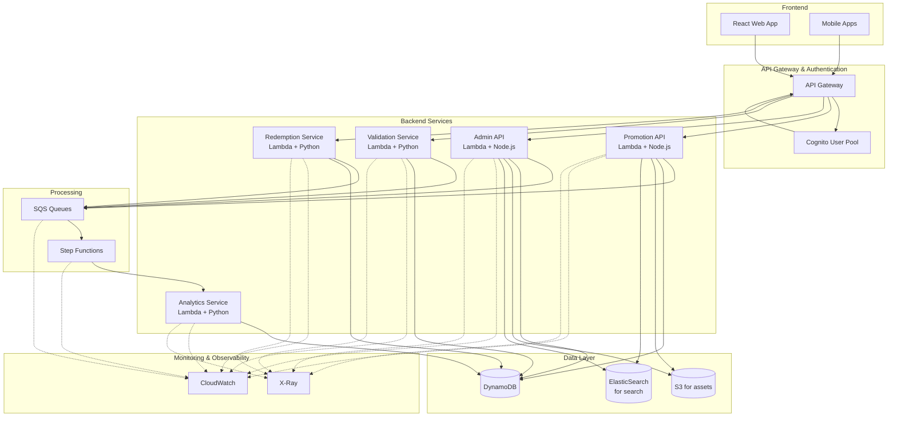
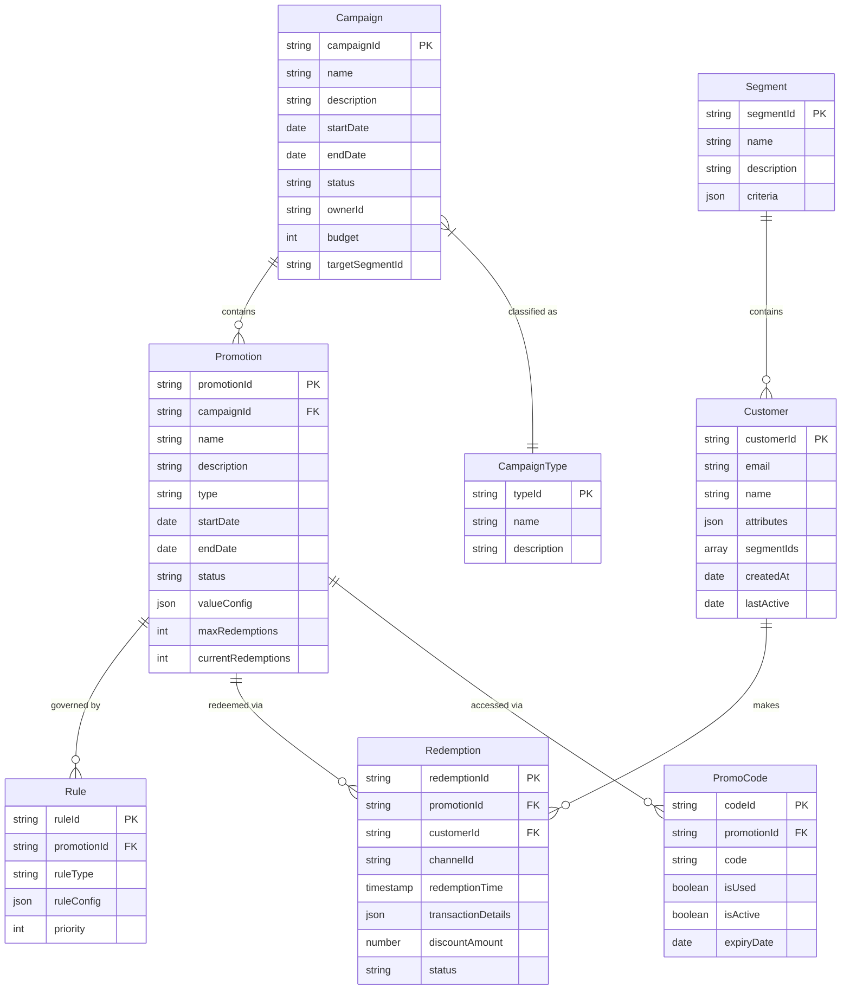
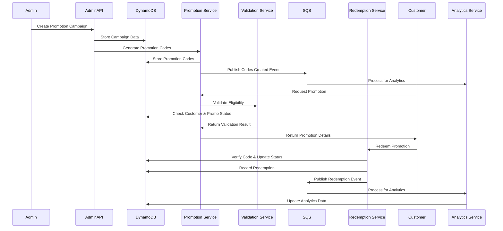

# Promotions System Architecture Overview

## Core Features Explained
### Campaign and Promotion Management
The system allows marketing teams to create promotional campaigns with multiple promotions. Each promotion can have different rules, target segments, and redemption methods. Campaigns are managed through the Admin API, which is built with Node.js running on Lambda.
### Rules Engine
A flexible rules engine (built with Python) evaluates promotion eligibility based on customer attributes, purchase history, location, and other parameters. Rules are stored as JSON configurations in DynamoDB and processed by the Validation Service.
### Multi-channel Distribution
Promotions can be distributed through various channels: email, mobile app, website, in-store, partner networks. Each channel integrates with the Promotion API to access relevant offers.
### Real-time Redemption Processing
When customers redeem promotions, the Redemption Service validates the transaction, updates inventory, and records analytics data. SQS queues ensure reliable processing of high-volume redemptions.
### Analytics and Reporting
The Analytics Service aggregates redemption data to provide insights on campaign performance, customer behavior, and ROI. This service uses Python for data processing and feeds dashboards in the admin portal.

## Technical Implementation Highlights

1. Serverless Architecture: Using Lambda functions for all backend services provides automatic scaling during high-traffic promotional periods.
2. Data Storage Strategy:
    - DynamoDB for transactional data (campaigns, promotions, redemptions)
    - ElasticSearch for advanced promotion search capabilities
    - S3 for promotional assets (images, videos, PDFs)
3. Event-driven Processing:
    - SQS queues decouple services for reliability
    - Step Functions orchestrate complex workflows like multi-stage promotions
4. Security Model:
    - Cognito manages authentication
    - Fine-grained IAM roles for each Lambda function
    - Field-level encryption for sensitive promotion data

## System Components and Flow

## Data Model

## Sequence Diagram

